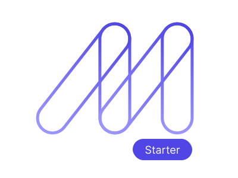

<div align="center">
  <p>
    <a href="https://maizzle.com/#gh-light-mode-only" target="_blank">
      
    </a>
    <a href="https://maizzle.com/#gh-dark-mode-only" target="_blank">
      
    </a>
  </p>
  <p>Netlify Identity Starter</p>
</div>

# About

HTML email templates for [Netlify Identity](https://www.netlify.com/docs/identity/), built with [Tailwind CSS](https://tailwindcss.com/) in [Maizzle](https://maizzle.com).

## Getting started

First, make sure you have installed the [Maizzle CLI](https://maizzle.com/docs/installation/#install-the-cli-globally) globally:

```
npm install -g @maizzle/cli
```

Then, scaffold a new project with this Starter:

```
maizzle new maizzle/starter-netlify-identity
```

Alternatively, you may clone this starter directly:

```bash
# remember to install dependencies with `npm install`

npx degit maizzle/starter-netlify-identity
```

## Development

Start a local development server:

```
npm run dev
```

Build for production:

```
npm run build
```

## Documentation

Maizzle documentation is available at https://maizzle.com
